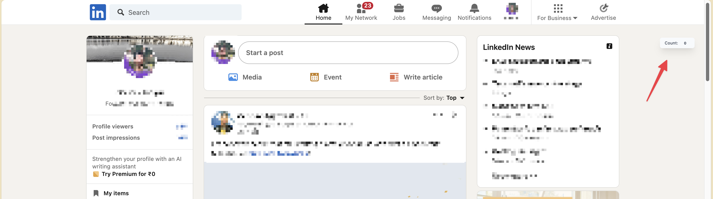

# ChatGPT Writer Take-Home Coding Assignment

This is a [Plasmo extension](https://docs.plasmo.com/) project bootstrapped with command: `pnpm create plasmo --with-tailwindcss`.

This is a chrome extension based task where I built a suggestion based chrome extension.


## **Here is Video Demo**
[Screencast from 2024-05-03 01-39-54.webm](https://github.com/DataRaj/Company-task-AI-based-chrome-extension/assets/87413639/18e9a434-2022-4579-8c31-dc6c6f01cedd)


## Getting Started

First, run the development server:

```bash
pnpm dev
# or
npm run dev
``` 

See how to load the extension: https://docs.plasmo.com/framework/workflows/dev#loading-the-extension

For further guidance, [visit our Documentation](https://docs.plasmo.com/).

## Where to edit?

- The main code is located in src/content.tsx. By default, when you run the extension, it displays a static count button on the LinkedIn website. You need to replace it with your own code.



## Making production build

Run the following:

```bash
pnpm build
# or
npm run build
```

This should create a production bundle for your extension, ready to be zipped and published to the stores.
